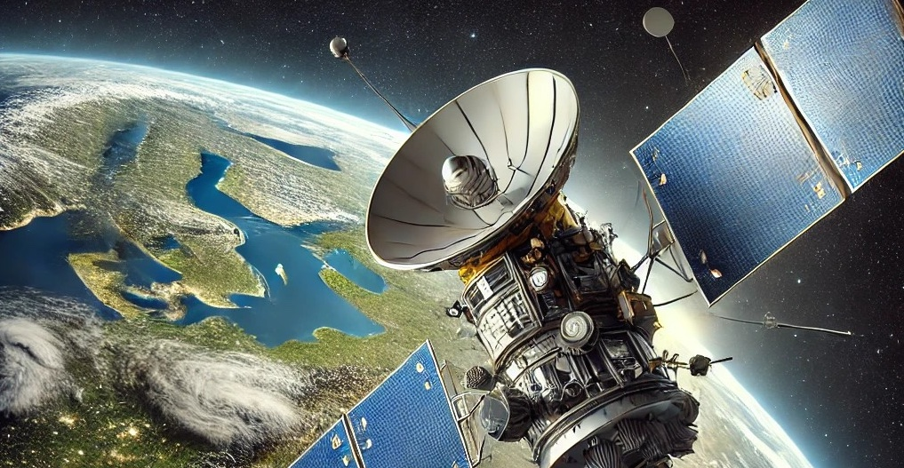

# Satellite Uncertainty Simulation with the PyEOSim Framework

*Tutorials prepared for the PANGEOS Summer School, Bucharest, 30th September-5th October 2024.*

# Prerequisites
1. Basic Python and Jupyter labs knowledge to use the Tutorials
2. Follow the installation guide [here](Treeview/pangeos-training-24/PANGEOS24_Case_Study_3B_Pre_Workshop.pdf)

# Background
End-to-end simulators for simulating optical Earth observation imagery are crucial for developing, testing, and optimising satellite instruments and observation strategies. The PyEOSim software is based on a published approach that provided a comprehensive methodology for end-to-end simulation of optical Earth observation imagery ([Coppo et al., 2013](https://typeset.io/papers/end-to-end-image-simulator-for-optical-imaging-systems-4huj67sbfv)). The study outlines a software tool designed for simulating data produced by optical instruments, utilising synthetic or airborne hyperspectral data. The simulator includes modules for generating the reflectance scenario, atmosphere, and instrument, allowing detailed simulation of everything from panchromatic to hyperspectral imagery. The flexible and modular approach allows for assessing target detection scenarios, data quality, and the impact of optical design on image quality, making this useful for designing new Earth observation optical instruments. The original software was validated through comparisons of synthetic and real spectra from ground and airborne platforms.

The PyEOSim module is a python library, written in 2020 to support the TreeView Mission Feasibility Study. It was used extensively to generate synthetic data for different bandpass filters and atmospheric scenarios, specifically to constrain the system requirements. Since 2020, there have been a number of other publications relating to imagery emulation but these did not have readily-available code or software available. [Matthews et al. (2023)](https://typeset.io/papers/demonstration-of-a-modular-prototype-end-to-end-simulator-55b6cwvsne?utm_source) present an approach for simulating multispectral imagery over water for various satellite instrument models. This simulator evaluates the impact of different sensor configurations on remote sensing products in aquatic environments, such as coral reefs and cyanobacterial blooms. It provides a tool for scientists and engineers to understand design trade-offs and optimise sensor specifications before deployment. It may be possible to obtain the software by [contacting them directly](https://www.smartsatcrc.com/). [Ravindra et al. (2021)](https://typeset.io/papers/earth-observation-simulator-eo-sim-an-open-source-software-q65x60sywc) present an open-source platform that facilitates the design and simulation of satellite constellations. This is more related to orbital design, however the instrupy module may have useful tools for atmospheric and geometric simulation. The code repositories related to this project are located [here](https://github.com/EarthObservationSimulator).

Other related projects include the [ESA Pyxel project](https://esa.gitlab.io/pyxel/). This has more of an astrophysics focus and allows very detailed simulation of the sensor and optic. This allows comprehensive simulation of the artefacts that occur during long exposure imaging (e.g. cosmic rays, charge bleed etc.) which have major implications for astrophysics experiments. These are likely to have a negligible effect in Time Delay Integration sensor systems such as those used in modern Earth Observation systems, but there could be interest in integrating this into the PyEOSim framework in the future. For atmospheric simulation, the [SixS](https://salsa.umd.edu/6spage.html) model is used for 1D radiative transfer modelling - each pixel is transformed separately and scattering artifacts are approximated using convolution with a spatial response kernel function. The PyEOSim system was designed to work with aerial imaging spectrometer data and so the input is a surface reflectance array. There are other, more comprehensive softwares for scene generation and atmospheric simulation, for example [Dart 3D](https://dart.omp.eu/), although these are more complicated to set up and have much higher computational cost than the approaches presented here.

We designed the library with three core principles:

- **OpenSource** - so that the code can be used for any purpose, including commercial applications.

- **Minimal**- we avoided writing lots of features so that the core code is stable and flexible.

- **Scalable**- the code has been built on [xarray](https://docs.xarray.dev/en/stable/) meaning that it can be run at scale if required

***References***

**Coppo, P.,** Chiarantini, L., & Alparone, L. (2013). End-to-End Image Simulator for Optical Imaging Systems: Equations and Simulation Examples. Advances in Optical Technologies. Available at: [https://typeset.io/papers/end-to-end-image-simulator-for-optical-imaging-systems-4huj67sbfv](https://typeset.io/papers/end-to-end-image-simulator-for-optical-imaging-systems-4huj67sbfv)

**Matthews, M. W.,** Dekker, A., Price, I., Drayson, N., Pease, J., Antoine, D., Anstee, J., Sharp, R., Woodgate, W., Phinn, S., & Gensemer, S. (2023). Demonstration of a Modular Prototype End-to-End Simulator for Aquatic Remote Sensing Applications. Journal Article. Available at: [https://www.mdpi.com/1424-8220/23/18/7824](https://www.mdpi.com/1424-8220/23/18/7824)

**Ravindra, V.,** Ketzner, R., & Nag, S. (2021). Earth Observation Simulator (EO-Sim): An Open-Source Software for Observation Systems Design. International Geoscience and Remote Sensing Symposium. Available at:[https://typeset.io/papers/earth-observation-simulator-eo-sim-an-open-source-software-q65x60sywct](https://typeset.io/papers/earth-observation-simulator-eo-sim-an-open-source-software-q65x60sywc)